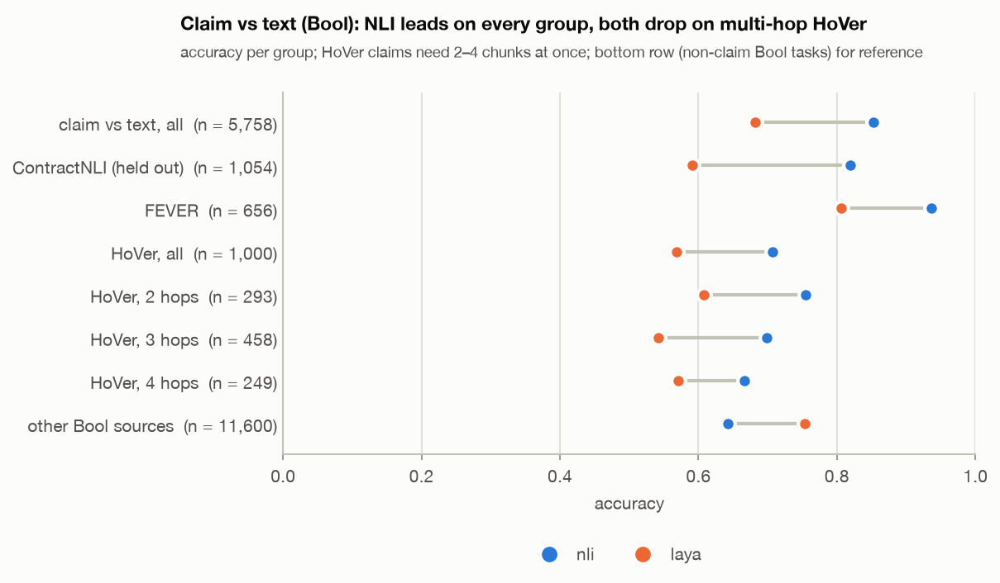
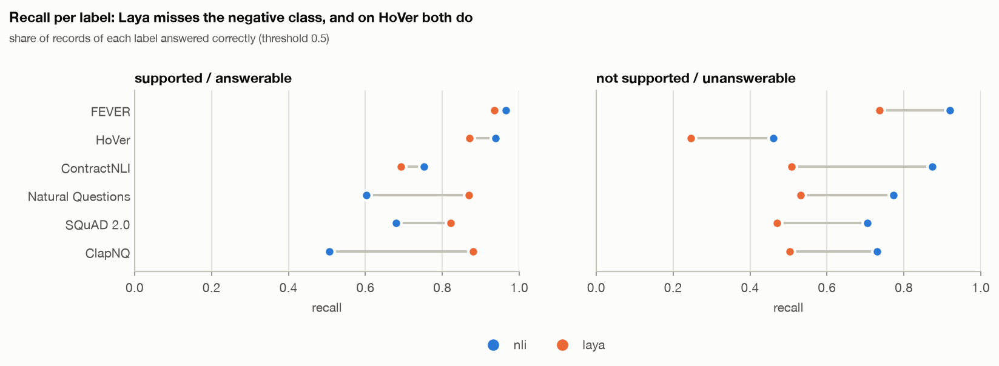
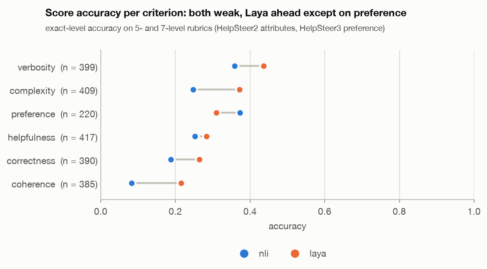
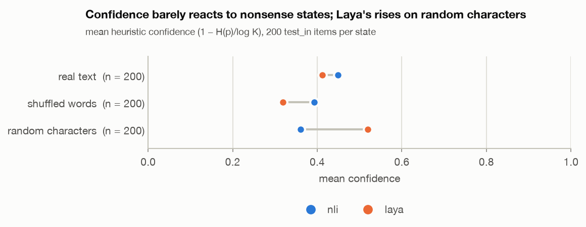

# Phase 2 baselines: Laya and zero-shot NLI

> Run on 2026-10-08 (todo Phase 2); **extended on 2026-10-10** with FEVER, HoVer and Natural Questions
> (5,000 new test records, Phase 3), so all numbers below are on the rebuilt test set. Both baselines are used **zero-shot**: no training, no fitted
> temperatures of our own. These are the numbers jev-lite has to beat offline (Phases 6–8).
> They do **not** answer H0 (jev-lite vs the production LLM judge): that needs the human-labelled
> judge test set from Phase 11.

## 1. Setup

**Test data.** `data/mix/stage_a/test_in.jsonl` (22,189 records) and `test_ood.jsonl` (25,368 records),
47,557 records in total, from 27 public datasets (`DATASETS.md`, section 0). FEVEROUS is postponed (its
page database does not fit the disk of a Kaggle session). Both Stage A versions
(`stage_a` and `stage_a_nosa`) share these files, so the numbers hold for both.

| Primitive | Records | Sources |
|---|---|---|
| Choice | 27,979 | MCQA (ARC, OpenBookQA, CommonsenseQA, Cosmos QA, Social IQa), intents and topics (CLINC150, BANKING77, MASSIVE, DBpedia-14, GoEmotions), 3-way NLI and fact checking (MultiNLI, SNLI, WANLI, VitaminC, ContractNLI, FEVER), summary preference |
| Score | 2,220 | HelpSteer2 (5 attributes), HelpSteer3 (preference) |
| Bool | 17,358 | NLI and fact checking (incl. FEVER and multi-hop HoVer), BoolQ, answerability (SQuAD 2.0, ClapNQ, Natural Questions, QNLI), PAWS, TabFact |

`test_ood` holds the held-out sources (ContractNLI, BANKING77, MultiNLI mismatched genres) and the
held-out question templates. Up to 1,000 records per source and split.

**Baselines**

| | NLI | Laya |
|---|---|---|
| Model | `MoritzLaurer/DeBERTa-v3-large-mnli-fever-anli-ling-wanli` (435M, MIT) | `convaiinnovations/laya`, base (421M, Apache 2.0) |
| What it is | a 3-way NLI cross-encoder | a Jev-like typed-decision model: ModernBERT-large + 2-layer decision head |
| Bool | P(entailment) of (state, claim) | a 2-option question (false / true) |
| Choice / Score | one templated hypothesis per candidate, softmax over the entailment logits | all options in one sequence, one `[MASK]` marker each |
| Temperatures | none | Laya's own, per question type and K bucket |
| Wrapper | `src/jevlite/baselines/nli.py` | `src/jevlite/baselines/laya.py` |

Coverage: both baselines predicted all 47,557 records, with no skipped questions. The 5,000 records of
the new sources were added on 2026-10-10 with `predict_baseline.py --resume`; every earlier record and
its prediction is unchanged.

**Hardware.** Laya ran on an M1 Pro (MPS, fp32). NLI ran partly on the M1 (MPS, fp32), partly on a
Colab T4 in fp32, and mostly on the T4 with fp16 autocast. Probabilities differ by about 1e-3
between these settings, which does not move any metric below. **Latency numbers are not comparable**
between the two baselines (section 7).

## 2. Headline numbers

Point estimates over all of `test_in` + `test_ood`; 95% bootstrap intervals in the per-model reports.
Bold marks the better baseline.

| Primitive | Metric | NLI | Laya |
|---|---|---|---|
| Choice | accuracy | 0.611 | **0.635** |
| | κ | 0.531 | **0.558** |
| | NLL | **1.053** | 1.525 |
| | ECE | **0.057** | 0.089 |
| | AURC | 0.244 | **0.222** |
| Score | accuracy | 0.241 | **0.314** |
| | weighted κ | 0.294 | **0.366** |
| | Spearman | 0.005 | **0.222** |
| | MAE (levels) | 1.205 | **1.027** |
| | ECE | **0.115** | 0.187 |
| Bool | accuracy | 0.712 | **0.730** |
| | κ | 0.425 | **0.456** |
| | NLL | 0.907 | **0.549** |
| | ECE | 0.202 | **0.070** |
| | AURC | 0.158 | **0.147** |
| | selective accuracy at 80% coverage | 0.763 | **0.780** |

The new sources moved the overall numbers by at most 0.005 (Score did not change: no new Score data).

The overall averages hide the main result: **the two baselines are good at different things**
(section 3).

## 3. Where each baseline wins


*Accuracy per source and primitive, sorted by the gap. Above the dashed line NLI wins (claim vs text, MCQA), below it Laya wins (classification, answerability, PAWS).* [Interactive version](docs/baselines/figures/accuracy_by_source.html)

### 3.1 Claim vs text (faithfulness-like): NLI wins clearly

This is the core of the judge: does a claim follow from the retrieved text.

| Bool sources | n | NLI | Laya |
|---|---|---|---|
| Claim vs text: MultiNLI, SNLI, WANLI, VitaminC, ContractNLI, FEVER, HoVer | 5,758 | **0.853** | 0.682 |
| the same without FEVER and HoVer (the 2026-10-08 group) | 4,102 | **0.875** | 0.690 |
| ContractNLI only (held out, `test_ood`) | 1,054 | **0.819** | 0.591 |
| FEVER (one chunk per evidence page) | 656 | **0.936** | 0.806 |
| HoVer (2–4 abstracts, multi-hop) | 1,000 | **0.707** | 0.568 |
| All other Bool sources | 11,600 | 0.642 | **0.753** |



*Bool accuracy per claim-vs-text group. NLI leads on every group, by 10–23 points. On HoVer NLI falls steadily with the number of hops (0.75 → 0.70 → 0.67), while Laya stays at 0.54–0.61, near chance. The bottom row, all other Bool tasks, is where Laya leads (section 3.2).* [Interactive version](docs/baselines/figures/faithfulness.html)



*Recall of each label. "Supported / answerable" is easy for both; the negative side separates them. Laya catches about half of the negatives everywhere except FEVER, and on HoVer both miss most of them (NLI 46%, Laya 25%).* [Interactive version](docs/baselines/figures/recall_by_label.html)

- On ContractNLI, a source neither model has seen, NLI leads by 23 points. This is the cleanest
  single-chunk faithfulness comparison we have.
- NLI's 0.95 on MultiNLI, 0.83 on WANLI and **0.94 on FEVER** are inflated: all three are in its
  training data. SNLI (0.947), ContractNLI and HoVer are not.
- **HoVer is the hardest faithfulness test so far**, and the closest to the judge: the claim needs
  every chunk of the state at once.
  - NLI 0.707 (κ 0.41); Laya 0.568 (κ 0.12, close to chance).
  - Both fail on the negative class: "not supported" is recognised in 46% (NLI) and 25% (Laya) of
    cases, against 94% and 87% for "supported". A likely reason (not checked case by case): the
    entities of a multi-hop claim all appear somewhere in the chunks even when the link between
    them is wrong.
  - Accuracy falls with the number of hops: NLI 0.754 / 0.699 / 0.667 for 2 / 3 / 4 hops.
- FEVER's NEI claims (the state is a passage about the claim's subject that lacks the fact) are the
  hard part of it: as Choice, "not mentioned" is right in 58% (NLI) and 51% (Laya) of cases.
- **The bar for jev-lite on faithfulness is the NLI model, not Laya**, and the target that matters is
  HoVer and ContractNLI, where it was not trained.

### 3.2 Other Bool tasks: Laya wins

| Source | Task | NLI | Laya |
|---|---|---|---|
| PAWS | paraphrase | 0.513 (κ 0.05, chance) | **0.890** |
| QNLI | sentence answers the question | 0.672 | **0.801** |
| BoolQ | yes/no QA | 0.725 | **0.777** |
| ClapNQ | answerable | 0.618 | **0.692** |
| Natural Questions | answerable | 0.643 | **0.787** |
| SQuAD 2.0 | answerable | **0.693** | 0.649 |
| TabFact | claim vs table | 0.583 | 0.513 (κ 0.02, chance) |

- Answerability (`criterion = answerable`, 6,600 records with NQ): Laya 0.741, NLI 0.665. This is
  the closest public proxy for judging refusals.
- The two err in opposite directions on NQ. Laya finds 87% of the answerable paragraphs but only 53%
  of the unanswerable ones; NLI 60% and 77%. For refusals (is "the documents don't say" justified?)
  the unanswerable side is the one that matters, and neither is good at it.
- PAWS shows the limit of NLI: paraphrase is not entailment, and the model is at chance there.
- **Tables are unsolved by both.** TabFact is at or near chance. The judge must handle tables
  (financial reports, docs), so table data in Phase 4 is not optional.

### 3.3 Choice: Laya wins classification, NLI wins multiple-choice QA

| Source | K | NLI | Laya |
|---|---|---|---|
| CLINC150 | 3–16 | 0.736 | **0.935** |
| BANKING77 (held out) | 3–16 | 0.670 | **0.843** |
| GoEmotions | 3–16 | 0.433 | **0.643** |
| DBpedia-14 | 3–14 | 0.905 | **0.916** |
| ARC | 3–8 | **0.604** | 0.433 |
| Cosmos QA | 4–7 | **0.463** | 0.273 |
| CommonsenseQA | 5–8 | **0.554** | 0.444 |
| OpenBookQA | 4–7 | **0.548** | 0.338 |
| Social IQa | 3–6 | **0.541** | 0.467 |
| 3-way NLI as Choice (VitaminC, SNLI, MultiNLI) | 3 | 0.54–0.58 | **0.65–0.71** |
| FEVER as Choice (supported / contradicted / not mentioned) | 3 | 0.693 | **0.699** |

- Laya is strong on intents and topics, its training domain, but weak on reasoning MCQA. On Cosmos
  QA it is close to chance.
- 3-way NLI as Choice: NLI is weaker here than on the same data as Bool, because the
  `supported / contradicted / not mentioned` options are scored through a hypothesis template,
  not through the model's own three classes.

### 3.4 Score: both are weak



*Exact-level accuracy per Score criterion. Laya leads on the five HelpSteer2 attributes, NLI on HelpSteer3 preference; NLI is near zero on coherence (0.08).* [Interactive version](docs/baselines/figures/score_by_criterion.html)

- Accuracy 0.24 (NLI) and 0.31 (Laya) on 5- and 7-level rubrics. NLI has no rank correlation at
  all (Spearman 0.005); Laya has 0.22.
- By criterion, Laya: coherence 0.22, correctness 0.26, helpfulness 0.28, verbosity 0.44.
- Rubric scoring is the easiest place for jev-lite to beat both baselines, and also the most
  needed: the relevance rubric of the judge is a Score question.

## 4. Calibration


*Reliability per primitive: on the diagonal = calibrated. NLI's Bool curve is flat in the middle and steep at the ends, i.e. extreme probabilities; both models are overconfident on Score.* [Interactive version](docs/baselines/figures/reliability.html)

**Laya's temperature buckets are miscalibrated at the edges.** Choice by number of options:


*Choice records: accuracy (filled) vs mean top probability (hollow) per K bucket. Laya is overconfident at K = 2 (+0.33) and K ≥ 11 (+0.22); NLI is mildly underconfident at large K.* [Interactive version](docs/baselines/figures/calibration_by_k.html)


| K | n | Laya accuracy | Laya mean confidence | Laya ECE | NLI ECE |
|---|---|---|---|---|---|
| 2 | 2,000 | 0.520 | 0.851 | 0.331 | 0.102 |
| 3–5 | 14,978 | 0.598 | 0.609 | **0.030** | 0.052 |
| 6–10 | 6,435 | 0.662 | 0.745 | 0.085 | 0.065 |
| 11+ | 4,566 | 0.765 | **0.985** | 0.220 | 0.118 |

- For K ≥ 11 Laya's fitted temperature is 0.10, which multiplies the logits by 10. It claims 98.5%
  confidence while it is right 76.5% of the time. NLL there is 4.2, which explains GoEmotions'
  NLL of 4.9.
- For K = 2 (summary preference) it is also overconfident: 0.85 claimed vs 0.52 observed.
- In the 3–5 bucket, the one with most data, it is well calibrated (ECE 0.030).
- This confirms the Phase 2 smoke result and the decision in todo 2.7: **fit a smooth T(K) instead
  of per-bucket temperatures**, and report ECE per K bucket in Phase 7.

**NLI is overconfident on Bool** (ECE 0.202, NLL 0.91). It gives extreme probabilities on tasks
it was not built for: PAWS ECE 0.31, TabFact 0.33, NQ 0.28, HoVer 0.25. On its own family it is well
calibrated: MultiNLI and SNLI ECE 0.03, FEVER 0.06.

## 5. Selective prediction (the cascade view)

Answer the most confident share locally and escalate the rest. Accuracy on the most confident 80%:


*Error rate of the answered share as coverage grows. For Bool both curves are close to straight lines: confidence barely separates right from wrong answers.* [Interactive version](docs/baselines/figures/risk_coverage.html)


| Primitive | NLI | Laya |
|---|---|---|
| Choice | 0.658 | 0.687 |
| Score | 0.233 | 0.336 |
| Bool | 0.763 | 0.780 |

Skipping the 20% least confident adds only about 5 points of accuracy for either model. Their
confidence (`1 − H(p)/log K`) is a weak escalation signal. See also section 6.3.

## 6. Black-box probes (200 items each, `test_in`)

Run on 2026-10-08 on the `test_in` of that day (no FEVER, HoVer, NQ); not re-run, since they test the
models' behaviour, not the sources.

### 6.1 Order sensitivity of Choice

| | NLI | Laya |
|---|---|---|
| mean spread of an option's probability over 8 permutations | 0.000 | **0.099** |
| max spread | 0.000 | 0.227 |
| argmax changes under a permutation | 0% | **14%** |

NLI scores each option independently, so it cannot depend on order. Laya, like our packed v1, reads
all options in one sequence: **the answer changes in 14% of permutations.** This is larger than the
smoke run of 2026-10-02 suggested (0.04 spread, no flips). Option shuffling in training (already in
`TrainCollator`) is required, and order sensitivity is a Phase 8 metric for jev-lite.

### 6.2 IIA (adding one option borrowed from another question)

| | NLI | Laya |
|---|---|---|
| mean change of log-ratios between the original options | 0.000 | **0.92** |
| probability mass taken by the added (wrong) option | 0.077 | 0.102 |

NLI satisfies IIA by construction. For Laya, adding an irrelevant option changes the ratios between
the existing ones substantially. Part of this is the K-bucket temperature jump (section 4).

### 6.3 Confidence on nonsense inputs

Mean heuristic confidence when the state is replaced:

| State | NLI | Laya |
|---|---|---|
| real | 0.449 | 0.412 |
| shuffled words | 0.393 | 0.319 |
| random characters | 0.361 | **0.519** |



*Mean heuristic confidence when the state is replaced by shuffled words or random characters. NLI drops by 0.06–0.09, Laya's confidence rises by 0.11 on random characters.* [Interactive version](docs/baselines/figures/nonsense_confidence.html)

**Neither model's confidence reliably drops on garbage.** Laya is *more* confident on random
characters than on real text. A confidence signal that does not notice a meaningless input cannot
decide escalation. This is the evidence for the learned confidence head (v2, todo 2.8) and for
keeping it in the v1 release (open decision in todo section 7).

## 7. Latency

| | p50 | p95 | Notes |
|---|---|---|---|
| Laya | 50 ms | 142 ms | M1 MPS fp32, one question per call |
| NLI | 26 ms | 329 ms | mixed hardware (M1, T4 fp32, T4 fp16); per record, amortised over batched calls |

Measured on 2026-10-08 (the records added later are not included). These are not comparable and not a latency benchmark. Latency is measured properly in Phase 9
(`bench_latency.py`) and per judged answer in Phase 10. Structurally, NLI costs K forward passes per
Choice/Score question and one per claim; Laya costs one per question.

## 8. What this means for jev-lite

Targets for Stage A/B on `test_in` + `test_ood`. They are the offline bars of Phases 6–8 ("Stage B
beats the baselines … for every primitive"); the H0–H3 success criteria on the human-labelled judge
test set were fixed separately on 2026-10-09 (todo 2.13).

| Area | Baseline to beat | Current best |
|---|---|---|
| Faithfulness (claim vs text) | NLI | 0.853 overall, **0.819 on held-out ContractNLI, 0.707 on multi-hop HoVer** |
| Answerability / refusals | Laya | 0.741 (NQ 0.787); unanswerable side: NLI 0.774 on NQ |
| Choice, classification | Laya | 0.94 CLINC150, 0.84 BANKING77 |
| Choice, MCQA | NLI | 0.46–0.60 |
| Score (rubrics) | Laya | accuracy 0.31, Spearman 0.22 |
| Calibration | best of both per primitive | ECE 0.057 (Choice, NLI), 0.115 (Score, NLI), 0.070 (Bool, Laya) |

Design consequences:

1. **Smooth T(K)**, not K buckets (section 4).
2. **Option shuffling in training** stays mandatory, and order sensitivity and IIA are reported for
   jev-lite in Phase 8 with the same probes (section 6).
3. **Learned confidence (v2)** is needed for the cascade: the entropy heuristic ignores nonsense
   inputs (section 6.3).
4. **Tables** need dedicated data (Phase 4); both baselines fail on TabFact.
5. A per-criterion H3 comparison should include NLI-style checkers. NLI is already a strong
   faithfulness specialist, which is exactly what H3 tests against.
6. **Claims that need several chunks** (HoVer) are where both baselines break, mostly by saying
   "supported" too often. This is the case for the judge's full-context pass (todo 2.12), and the
   multi-hop and "partly supported" negatives in the synthetic data (Phase 4) should target it.

## 9. Caveats

- **Contamination.** The NLI model was trained on MultiNLI, FEVER, ANLI, LingNLI and WANLI, so its
  MultiNLI, WANLI and FEVER numbers are in-distribution. HoVer and NQ are not in its training data. Laya's training data is not published; it may
  overlap with our sources (it lists NLI, intents and quality rubrics among its domains).
- **`test_in` vs `test_ood` is confounded by source mix.** For example, Laya's Choice accuracy is
  *higher* on `test_ood` (0.656 vs 0.600) because BANKING77, where it is strong, is held out
  entirely. Compare per source, not per split.
- **These are public-data proxies.** The offline judge benchmark (LLM-AggreFact, RAGTruth, …) is
  not converted yet, and human-labelled data from our system only arrives in Phase 11.
- **Templates matter for NLI.** Choice and Score through hypothesis templates are a weak use of an
  NLI model; better templates would raise its Choice numbers somewhat.
- One run each, no seeds: zero-shot inference is deterministic up to hardware noise.

## 10. Files and reproduction

All outputs are under `data/baselines/` (git-ignored):

- `preds/{laya,nli}.jsonl`: predictions;
- `reports/{laya,nli}/report.{md,json}`: full reports with bootstrap CIs, per split, source,
  domain and criterion;
- `reports/compare/report.md` and `figures/`: side-by-side tables, reliability diagrams,
  risk–coverage curves (PNG and interactive HTML);
- `probes/{laya,nli}.json`: black-box probes.

```
# predictions (NLI: --device cuda --fp16 --batch-size 64 on a CUDA GPU)
HF_HUB_OFFLINE=1 uv run python scripts/predict_baseline.py --baseline laya \
  --data data/mix/stage_a/test_in.jsonl data/mix/stage_a/test_ood.jsonl --out data/baselines/preds/laya.jsonl
HF_HUB_OFFLINE=1 uv run python scripts/predict_baseline.py --baseline nli \
  --data data/mix/stage_a/test_in.jsonl data/mix/stage_a/test_ood.jsonl --out data/baselines/preds/nli.jsonl

# reports
uv run python scripts/eval.py --data data/mix/stage_a/test_in.jsonl data/mix/stage_a/test_ood.jsonl \
  --pred data/baselines/preds/laya.jsonl --out data/baselines/reports/laya --bootstrap 1000
uv run python scripts/eval.py --data data/mix/stage_a/test_in.jsonl data/mix/stage_a/test_ood.jsonl \
  --pred data/baselines/preds/nli.jsonl --out data/baselines/reports/nli --bootstrap 1000
uv run python scripts/make_report.py compare --out data/baselines/reports/compare \
  --run nli=data/baselines/reports/nli/report.json --run laya=data/baselines/reports/laya/report.json

# probes
HF_HUB_OFFLINE=1 uv run python scripts/probe_blackbox.py --baseline laya \
  --data data/mix/stage_a/test_in.jsonl --out data/baselines/probes/laya.json --n-items 200
HF_HUB_OFFLINE=1 uv run python scripts/probe_blackbox.py --baseline nli \
  --data data/mix/stage_a/test_in.jsonl --out data/baselines/probes/nli.json --n-items 200
```

The K-bucket table in section 4, the source groups in section 3.1 and the per-label / per-hop splits
of FEVER, HoVer and NQ were computed from `preds/*.jsonl` and the test files; they are not part of
`eval.py`'s output. The predictions of the new sources were appended with `--resume` (same commands).

The figures (PNG + interactive HTML, tracked in `docs/baselines/figures/`) are rebuilt from the same inputs.
Since 2026-10-10 they include the new sources:

```
uv run --extra reports python scripts/make_baselines_figures.py
```
