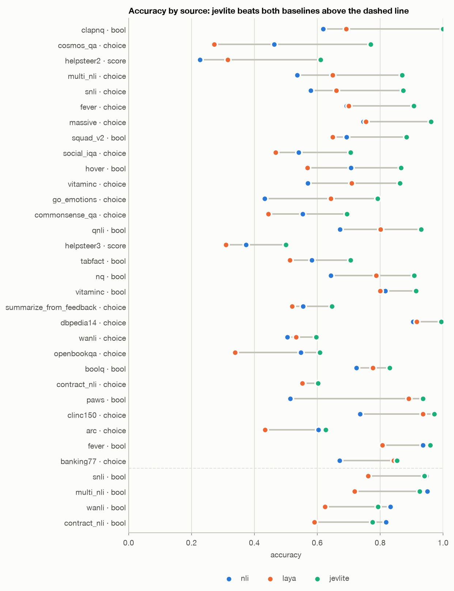
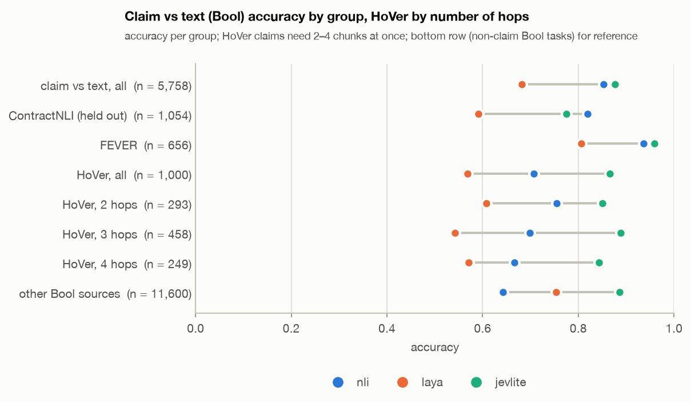
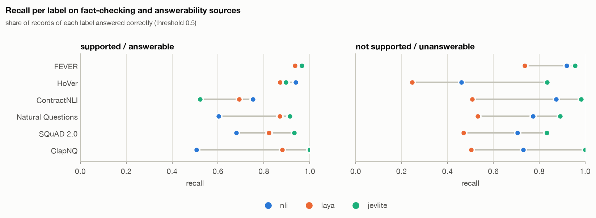
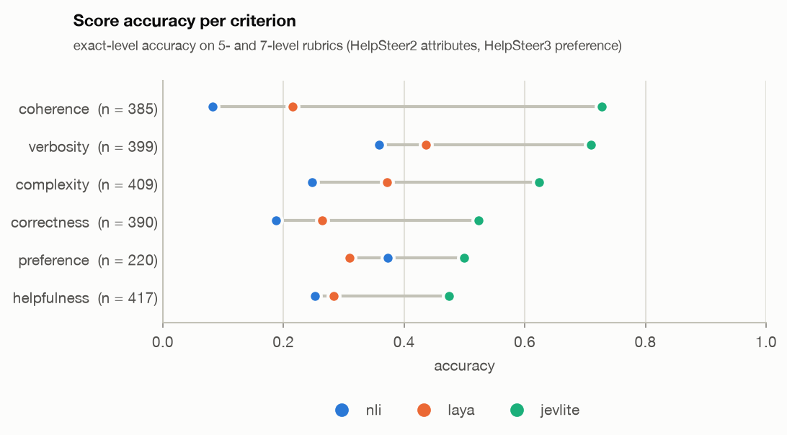
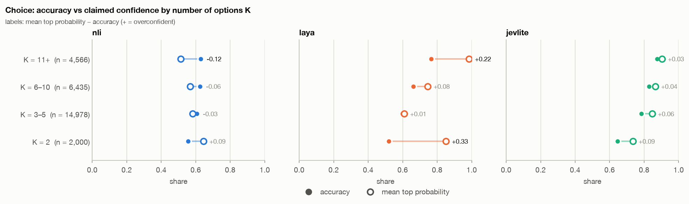
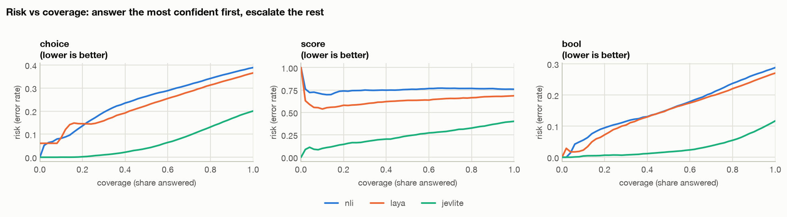
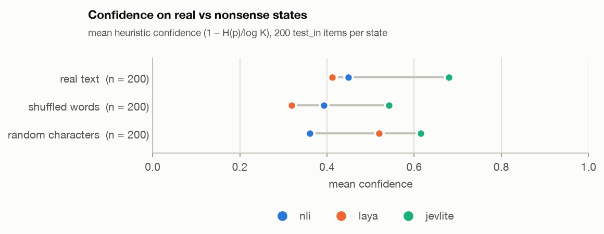
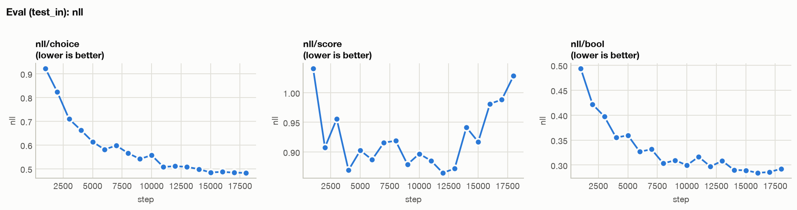

# Stage A: jev-lite on public data vs the baselines

> Run `stage_a-full-s42`, trained and evaluated on 2026-10-10 (todo Phase 6, "Stage A — evaluation").
> The first trained jev-lite model, compared with the zero-shot baselines of `BASELINES.md` on the
> same 47,557 test records. Offline public-data numbers only: they do **not** answer H0 (jev-lite vs the
> production LLM judge), which needs the human-labelled judge test set of Phase 11.

**In short.**

- jev-lite beats both baselines on every primitive, on `test_in` and on `test_ood`: Bool 0.883 vs 0.730, Choice 0.800 vs 0.635, Score 0.599 vs 0.314 (best baseline each).
- It is also better calibrated before any temperature is fitted: Bool ECE 0.033, NLL 0.285.
- It solves the multi-hop faithfulness case that broke both baselines: HoVer 0.866 vs 0.707. Tables are no longer at chance: TabFact 0.706.
- **One bar is not met:** held-out ContractNLI, 0.775 vs NLI's 0.819. The ranking there is better (AUC 0.931 vs 0.884); the threshold is not, and the model is too sceptical on an unseen domain.
- Three issues were found: ClapNQ's 1.000 is a data shortcut (section 8), Score overfits in the second epoch (section 7), and confidence still does not drop on nonsense inputs (section 6).

## 1. Setup

**Model.** `answerdotai/ModernBERT-large` (395M), raw, full fine-tuning; packed encoding with one `[MASK]` marker per candidate, a shared 1024 → 256 trunk and three heads (todo 2.4–2.5). No temperatures: `log_T` stays at 0 until Phase 7.

**Data.** Mix `stage_a` (`data/mix/stage_a/mix_report.md`): 27 public datasets, 300k training records per epoch (Bool 50%, Choice 20%, Score 30%), max length 512, Choice options shuffled per epoch. Test sets: `test_in` 22,189 and `test_ood` 25,368 records, the same files as in `BASELINES.md`. `test_ood` holds the sources never trained on (ContractNLI, BANKING77, MultiNLI mismatched genres) and the held-out question templates.

**Recipe** (`configs/base.yaml` + `configs/cuda.yaml`, commit `e747da8`: the training code of `3554a4b` plus the baseline charts):

| | |
|---|---|
| Hardware | Kaggle 2×T4, DDP, fp16 AMP + GradScaler, `sdpa`, gradient checkpointing |
| Optimiser | 8-bit AdamW, lr 3e-5, warmup 6%, linear decay, weight decay 0.01, clip 1.0 |
| Batch | 16 per GPU, effective 32, length-grouped |
| Length | 2 epochs = 18,750 steps |
| Time | 566 min of training (1.8 s/step incl. evals) + 14 min of final predictions; one Kaggle session |
| Loss | CE (Choice), CE + 0.5·EMD² (Score), BCE + 0.1·Brier (Bool); weights 1 / 1 / 1 |

Eval every 1,000 steps on a fixed 2,000-record subset per split; final predictions on all test records.

**How to read the comparison.** The baselines are zero-shot; jev-lite was trained on the train splits of the same sources. `test_in` is therefore in-distribution for jev-lite only. The fair claims rest on `test_ood` and on the faithfulness sources it was not tuned on, ContractNLI and HoVer's held-out templates. Neither side has fitted temperatures.

## 2. Headline numbers

Point estimates over all of `test_in` + `test_ood`; 95% bootstrap intervals (1,000 resamples) in `data/runs/stage_a-full-s42/report/`.



*Accuracy per source and primitive, sorted by "jev-lite − best baseline". jev-lite beats both baselines on every row above the dashed line; below it are ContractNLI, WANLI, MultiNLI and SNLI as Bool, where NLI stays ahead.* [Interactive version](docs/stage_a/figures/accuracy_by_source.html)

| Primitive | Metric | NLI | Laya | jev-lite | jev-lite 95% CI |
|---|---|---|---|---|---|
| Bool | accuracy | 0.712 | 0.730 | **0.883** | 0.878–0.888 |
| | κ | 0.425 | 0.456 | **0.766** | 0.756–0.776 |
| | NLL | 0.907 | 0.549 | **0.285** | |
| | ECE | 0.202 | 0.070 | **0.033** | 0.030–0.038 |
| | AURC | 0.158 | 0.147 | **0.030** | |
| | selective accuracy at 80% | 0.763 | 0.780 | **0.945** | |
| Choice | accuracy | 0.611 | 0.635 | **0.800** | 0.795–0.804 |
| | κ | 0.531 | 0.558 | **0.758** | 0.752–0.764 |
| | NLL | 1.053 | 1.525 | **0.542** | |
| | ECE | 0.057 | 0.089 | **0.052** | 0.048–0.057 |
| | AURC | 0.244 | 0.222 | **0.063** | |
| Score | accuracy | 0.241 | 0.314 | **0.599** | 0.579–0.619 |
| | weighted κ | 0.294 | 0.366 | **0.678** | 0.643–0.710 |
| | Spearman | 0.005 | 0.222 | **0.666** | |
| | MAE (levels) | 1.205 | 1.027 | **0.591** | |
| | ECE | 0.115 | 0.187 | **0.104** | 0.089–0.123 |

**By split.** jev-lite is at the same level on `test_ood` as on `test_in`, while the baselines' numbers move with the source mix (`BASELINES.md` section 9):

| | `test_in`: NLI / Laya / jev-lite | `test_ood`: NLI / Laya / jev-lite |
|---|---|---|
| Bool | 0.759 / 0.722 / **0.884** | 0.638 / 0.741 / **0.882** |
| Choice | 0.595 / 0.600 / **0.805** | 0.621 / 0.656 / **0.796** |
| Score | 0.245 / 0.312 / **0.618** | 0.238 / 0.317 / **0.581** |

**Without ClapNQ** (section 8): Bool 0.879 overall, 0.876 on `test_ood`; answerability 0.907 (NLI 0.669, Laya 0.746).

## 3. Where it wins and where it does not

### 3.1 Claim vs text (faithfulness)



*Bool accuracy per claim-vs-text group. jev-lite leads overall and on FEVER and HoVer; on held-out ContractNLI NLI stays ahead.* [Interactive version](docs/stage_a/figures/faithfulness.html)

| Bool sources | n | NLI | Laya | jev-lite |
|---|---|---|---|---|
| Claim vs text, all (MultiNLI, SNLI, WANLI, VitaminC, ContractNLI, FEVER, HoVer) | 5,758 | 0.853 | 0.682 | **0.877** |
| ContractNLI (held out, `test_ood`) | 1,054 | **0.819** | 0.591 | 0.775 |
| FEVER | 656 | 0.936 | 0.806 | **0.959** |
| HoVer, all | 1,000 | 0.707 | 0.568 | **0.866** |
| HoVer, 2 / 3 / 4 hops | 293 / 458 / 249 | 0.754 / 0.699 / 0.667 | 0.608 / 0.541 / 0.570 | **0.850 / 0.889 / 0.843** |
| VitaminC | 658 | 0.816 | 0.799 | **0.913** |
| MultiNLI / SNLI / WANLI | 1,053 / 674 / 663 | **0.950 / 0.947 / 0.833** | 0.718 / 0.761 / 0.624 | 0.925 / 0.941 / 0.793 |

- **HoVer is solved much better.** It is the closest public proxy for the judge's full-context pass, since every claim needs 2–4 abstracts. jev-lite does not lose accuracy with the number of hops, and it catches "not supported" in 84% of cases (NLI 46%, Laya 25%).
- **ContractNLI is the one faithfulness bar not met** (section 3.2).
- On MultiNLI, SNLI and WANLI, NLI keeps a small lead of 0.6–4 points. All three are in NLI's own training data (`BASELINES.md` section 9), so this is the expected order.

### 3.2 ContractNLI: good ranking, wrong threshold

| ContractNLI, Bool | NLI | Laya | jev-lite |
|---|---|---|---|
| ROC AUC | 0.884 | 0.650 | **0.931** |
| accuracy at 0.5 | **0.819** | 0.591 | 0.775 |
| accuracy at the best threshold (chosen on the test set: an upper bound) | 0.824 | 0.618 | **0.868** |
| mean P(supported) (45% of records are positive) | 0.42 | 0.54 | **0.26** |
| recall: supported / not supported | 0.75 / 0.87 | 0.69 / 0.51 | **0.52** / 0.98 |

jev-lite orders ContractNLI claims better than NLI, but its probabilities are shifted down: on legal NDAs, a domain and a document style it has not seen, it calls half of the supported claims unsupported. For the judge this is the failure mode to expect on a new customer domain: **too strict, not too lenient**. Temperature scaling (Phase 7) cannot fix it, since a temperature does not move the 0.5 point of a Bool. What can:

- more domain variety in the training data (Phase 4: synthetic data over 18 domains, 4 held out);
- a bias term in the answer-level calibrator fitted on in-domain labels (Phase 11 already plans one on human labels);
- watching the per-domain base rate in production.

### 3.3 Answerability and the negative class



*Recall of each label. The baselines' weak side was "not supported / unanswerable"; jev-lite's weak side is "supported" on ContractNLI. The ClapNQ row is a shortcut (section 8).* [Interactive version](docs/stage_a/figures/recall_by_label.html)

| Recall: positive / negative | NLI | Laya | jev-lite |
|---|---|---|---|
| FEVER | 0.97 / 0.92 | 0.94 / 0.74 | **0.97 / 0.96** |
| HoVer | 0.94 / 0.46 | 0.87 / 0.25 | 0.90 / **0.84** |
| ContractNLI | **0.75** / 0.87 | 0.69 / 0.51 | 0.52 / **0.98** |
| Natural Questions | 0.60 / 0.77 | 0.87 / 0.53 | **0.91 / 0.89** |
| SQuAD 2.0 | 0.68 / 0.71 | 0.82 / 0.47 | **0.93 / 0.83** |

- Answerability, the closest public proxy for judging refusals: 0.907 without ClapNQ (Laya 0.746, NLI 0.669). Both sides of NQ are now near 0.9; for both baselines one side had been near chance.
- QNLI 0.930 (Laya 0.801), BoolQ 0.831 (0.777), PAWS 0.936 (0.890).

### 3.4 Other Bool tasks and Choice

| Source | NLI | Laya | jev-lite |
|---|---|---|---|
| TabFact (claim vs table) | 0.583 | 0.513 | **0.706** |
| CLINC150 / BANKING77 (held out) | 0.736 / 0.670 | 0.935 / 0.843 | **0.972 / 0.853** |
| GoEmotions / MASSIVE / DBpedia-14 | 0.433 / 0.747 / 0.905 | 0.643 / 0.755 / 0.916 | **0.792 / 0.961 / 0.994** |
| ARC / OpenBookQA / CommonsenseQA | 0.604 / 0.548 / 0.554 | 0.433 / 0.338 / 0.444 | **0.627 / 0.608 / 0.694** |
| Cosmos QA / Social IQa | 0.463 / 0.541 | 0.273 / 0.467 | **0.769 / 0.705** |
| 3-way NLI as Choice (VitaminC, SNLI, MultiNLI) | 0.54–0.58 | 0.65–0.71 | **0.86–0.87** |
| FEVER as Choice | 0.693 | 0.699 | **0.906** |
| ContractNLI as Choice (held out) | 0.554 | 0.553 | **0.603** |
| Summary preference (K = 2) | 0.555 | 0.520 | **0.646** |

- Tables are no longer at chance, but 0.706 is far from usable for a judge. Table data in Phase 4 stays required.
- On BANKING77, the held-out intent set, the lead over Laya is only 1 point: Laya was trained on intents.
- MCQA is the weakest Choice family on knowledge-heavy sets (ARC, OpenBookQA, 0.61–0.63). That is expected from a 395M encoder and does not matter for the judge.

### 3.5 Score



*Exact-level accuracy per criterion (HelpSteer2 attributes and HelpSteer3 preference).* [Interactive version](docs/stage_a/figures/score_by_criterion.html)

| Criterion | NLI | Laya | jev-lite |
|---|---|---|---|
| coherence | 0.083 | 0.216 | **0.727** |
| verbosity | 0.358 | 0.436 | **0.709** |
| complexity | 0.247 | 0.372 | **0.623** |
| correctness | 0.187 | 0.264 | **0.523** |
| helpfulness | 0.252 | 0.283 | **0.475** |
| preference (HelpSteer3) | 0.373 | 0.309 | **0.500** |

Spearman 0.666 and MAE 0.59 levels, against 0.22 and 1.03 for Laya. The criteria the judge's relevance rubric resembles most, correctness and helpfulness, are the weakest (0.48–0.52). This is the place where our own labels (Phase 11) should help most.

## 4. Calibration


*Reliability per primitive. jev-lite's Bool curve is close to the diagonal (slightly above it at low probabilities, i.e. a little underconfident there); NLI's is flat in the middle. On Score jev-lite is the only model whose curve rises with confidence.* [Interactive version](docs/stage_a/figures/reliability.html)



*Choice: accuracy (filled) vs mean top probability (hollow) per K bucket. jev-lite is mildly overconfident in every bucket, with no jump at bucket edges.* [Interactive version](docs/stage_a/figures/calibration_by_k.html)

| K | n | jev-lite accuracy | mean confidence | gap | Laya gap |
|---|---|---|---|---|---|
| 2 | 2,000 | 0.646 | 0.734 | +0.09 | +0.33 |
| 3–5 | 14,978 | 0.784 | 0.846 | +0.06 | +0.01 |
| 6–10 | 6,435 | 0.829 | 0.865 | +0.04 | +0.08 |
| 11+ | 4,566 | 0.876 | 0.904 | +0.03 | +0.22 |

- Bool ECE 0.033 and Choice ECE 0.052 before any temperature. Both are below the best baseline per primitive, which was the calibration bar of `BASELINES.md` section 8.
- The overconfidence is small and smooth in K. A single temperature, or the smooth T(K) of todo 2.7, should remove most of it in Phase 7.
- Score ECE is 0.104 (MCE 0.23), the weakest; the Score overfitting of section 7 is the likely cause.

## 5. Selective prediction (the cascade view)



*Error rate of the answered share as coverage grows. jev-lite's error stays near zero for the most confident 40–60% and rises only after that; the baselines' curves rise almost linearly from the start, i.e. their confidence barely separates right from wrong answers.* [Interactive version](docs/stage_a/figures/risk_coverage.html)

| Accuracy on the most confident share | 80%: NLI / Laya / jev-lite | 90%: jev-lite |
|---|---|---|
| Bool | 0.763 / 0.780 / **0.945** | 0.918 |
| Choice | 0.658 / 0.687 / **0.869** | 0.832 |
| Score | 0.233 / 0.336 / **0.675** | 0.633 |

Escalating the 20% least confident Bool answers lifts accuracy from 0.883 to 0.945; AURC falls from 0.147 (Laya) to 0.030. The cascade of todo 2.12 becomes viable on this signal, with the caveat of section 6.3.

## 6. Black-box probes (200 items, `test_in`)

Run with `probe_blackbox.py --baseline jevlite`. **Caveat:** the baselines' probes ran on the `test_in` of 2026-10-08, before FEVER, HoVer and NQ were added, so their 200-item sample differs from ours. The comparison is indicative. Re-running the baseline probes on today's sample needs no Kaggle quota.

### 6.1 Order sensitivity and IIA

| | NLI | Laya | jev-lite |
|---|---|---|---|
| mean spread of an option's probability over 8 permutations | 0.000 | 0.099 | **0.045** |
| argmax changes under a permutation | 0% | 14% | **3.9%** |
| mean change of log-ratios when an option is added (IIA) | 0.000 | 0.92 | **0.34** |
| probability mass taken by the added (wrong) option | 0.077 | 0.102 | **0.015** |

Option shuffling in training worked: the packed layout reads options in one sequence and is not order-free by construction, yet the answer flips in 3.9% of permutations against Laya's 14%. An irrelevant extra option takes 1.5% of the mass, which is less than NLI, an order-free model, gives it.

### 6.2 Confidence on nonsense inputs



*Mean heuristic confidence when the state is replaced.* [Interactive version](docs/stage_a/figures/nonsense_confidence.html)

| State | NLI | Laya | jev-lite |
|---|---|---|---|
| real | 0.449 | 0.412 | 0.680 |
| shuffled words | 0.393 | 0.319 | 0.542 |
| random characters | 0.361 | 0.519 | 0.615 |

### 6.3 What it means

**Confidence still does not notice garbage.** On random characters jev-lite is almost as confident (0.62) as on real text (0.68), and more confident than on shuffled words. The entropy heuristic is a good ranking signal on real inputs (section 5), but it cannot catch inputs that are broken or off-distribution. That is what the learned confidence head (v2, todo 2.8) is for. Keep it in the v1 release (open decision in todo section 7).

## 7. Training dynamics



*Eval NLL on the fixed 2,000-record `test_in` subset. Bool and Choice keep improving to the end; Score bottoms out around step 12k and then rises.* Also in `docs/stage_a/training/`: accuracy and ECE per split, train loss, accuracy, learning rate and grad norm.

- **Bool and Choice** improve through both epochs. Their gains in the second half are small: Bool `test_in` accuracy 0.868 at step 9k (the epoch boundary), 0.882–0.886 from 14k on.
- **Score overfits in epoch 2.** Eval NLL/score drops to 0.87 at step 12k and rises to 1.03 by step 18k, while Bool and Choice are still improving. The cause:
  - Score is 30% of the mix, 90k records per epoch from a pool of 59k: 1.52× per epoch, ~3× per run.
  - HelpSteer2 rates every response on five attributes, so a response text comes back ~15 times over the run.
  - **Decision (2026-10-10):** keep the 30% share. From Stage B on, every Score record is seen at most once per run (`run_repeat: {score: 1.0}`), and Score's share of the gradient is kept by the loss weights (score 1.41, choice 0.93, bool 0.98 on the Stage A mix). `build_mix.py --batch-size` measures them on the length-grouped batches (todo, Stage B).
- **Train vs eval:** in the last 2,750 steps train accuracy is Bool 0.911 / Choice 0.823, eval 0.882–0.886 / 0.824 on `test_in`. That is a small gap, except for Score.
- **Grad norm 10–14 for the whole run, against a clip of 1.0:** every update was clipped, so the effective step is set by the clip, not by the learning rate. It trained well regardless. To look at before Stage B (cheap checks): the norm with AMP unscaling confirmed, per-layer norms, and a higher clip or a lower lr in a short run.
- No time-outs: 566 minutes against the 690-minute limit, one session, no resume needed.

## 8. A data issue found: ClapNQ

jev-lite scores **1.000 on all 600 ClapNQ test records**, against 0.907 on Natural Questions. A passage-swap test shows the label follows the passage, not the question:

| ClapNQ, mean P(answerable) | passage of an answerable record | passage of an unanswerable record |
|---|---|---|
| answerable question | 0.978 | 0.002 |
| unanswerable question | 0.948 | 0.002 |

- ClapNQ builds its two classes from different passage pools, so no passage occurs with both labels. The model learned which pool a passage comes from.
- NQ and SQuAD 2.0 pass the same test: with any mismatched passage, P(answerable) is 0.01–0.04.
- Kept as is in Stage A, since ClapNQ is 0.8% of the training data. It is excluded from the headline answerability number and fixed for Stage B.
- Full account, checks and fix: `DATASETS.md` section 5.1.

## 9. Against the bars of `BASELINES.md` section 8

| Area | Bar (best baseline) | jev-lite | Met |
|---|---|---|---|
| Faithfulness, claim vs text | NLI 0.853 | 0.877 | ✓ |
| Faithfulness, held-out ContractNLI | NLI 0.819 | 0.775 (AUC 0.931 vs 0.884) | **✗** (ranking ✓, threshold ✗) |
| Faithfulness, multi-hop HoVer | NLI 0.707 | 0.866 | ✓ |
| Answerability / refusals (without ClapNQ) | Laya 0.746 | 0.907 | ✓ |
| Unanswerable side, NQ | NLI 0.774 | 0.891 | ✓ |
| Choice, classification (CLINC150 / BANKING77) | Laya 0.935 / 0.843 | 0.972 / 0.853 | ✓ |
| Choice, MCQA | NLI 0.46–0.60 | 0.61–0.77 | ✓ |
| Score (rubrics) | Laya accuracy 0.31, Spearman 0.22 | 0.60, 0.67 | ✓ |
| Calibration, ECE per primitive | 0.057 Choice (NLI), 0.115 Score (NLI), 0.070 Bool (Laya) | 0.052 / 0.104 / 0.033 | ✓ |

The design consequences of `BASELINES.md` section 8, checked:

1. **Smooth T(K):** no K-bucket jumps, mild overconfidence everywhere (section 4); fit T in Phase 7.
2. **Option shuffling:** works, with 3.9% order flips (section 6.1).
3. **Learned confidence:** still needed (section 6.3).
4. **Tables:** better but weak, 0.706 (section 3.4); table data in Phase 4.
5. **Claims across several chunks:** HoVer 0.866, and "not supported" is now caught (section 3.1).

## 10. What it means for Stage B

1. **Domain shift is the main risk for the judge.** On ContractNLI the model is too strict. Stage B's synthetic data needs domain variety with held-out domains (Phase 4), and Phase 7/11 need a calibrator that can move the threshold, not only the temperature.
2. **Data hygiene:** positives and negatives must come from the same passage pool (ClapNQ, section 8). Run the passage-swap test on every answerability source, synthetic ones included (todo Phase 4 and Phase 8).
3. **Score recipe:** at most one pass per record per run, with compensating loss weights (section 7).
4. **Confidence head (v2)** for the cascade (section 6.3).
5. **Starting point:** Stage B starts from this checkpoint (or from `stage_a_nosa`, if it is trained and preferred; todo Phase 6).
6. **Quota:** the Kaggle GPU quota is the constraint. Stage B with the Score cap is ~20% shorter per epoch, and dropping gradient checkpointing may save another 25–30% if memory allows (todo, status).

## 11. Caveats

- **In-distribution training.** jev-lite saw the train splits of 25 of the 27 test sources; the baselines saw none (NLI saw MultiNLI, FEVER and WANLI). Per-source `test_in` numbers favour jev-lite. The held-out sources (ContractNLI, BANKING77, MultiNLI mismatched) and templates are the fair test.
- **Passage overlap with train** is small for most sources but not zero: HelpSteer3 58% (shared conversation prefixes), BoolQ 29% (shared Wikipedia passages), NQ 11%, HoVer 6%, the rest ≤ 5%. The effect is mixed: on the overlapping records accuracy is higher for HelpSteer3 (+12 points), BoolQ, NQ and HoVer (+3–4), and lower for FEVER and HelpSteer2. It is not the source of the overall lead: the held-out sources show the same level (section 2).
- **One run, one seed.** Bootstrap intervals cover test sampling, not training variance.
- **No temperatures and no learned confidence** yet (Phases 7 and 2.8). The calibration numbers are raw.
- **Probes** on a different 200-item sample than the baselines (section 6).
- **Public proxies only.** Not the judge task itself: the offline judge benchmark (LLM-AggreFact, RAGTruth) is not converted yet, and our own data arrives in Phase 11.
- **The intermediate eval curves** use a fixed 2,000-record subset per split (Score: 116 and 81 records), so Score points are noisy (±0.05). The final numbers use all records.

## 12. Files and reproduction

Run files (git-ignored), `data/runs/stage_a-full-s42/`: `final/` (encoder + heads, loadable with `checkpoint.load_final`), `preds.jsonl`, `report/report.{md,json}`, `probes.json`, `metrics.jsonl`, `run.log`, `config.yaml`. The same files are in the private Hub repo `Nefelim584/jevlite-runs`, folder `stage_a-full-s42/`, with the last two checkpoints.

Charts and reports (tracked): `docs/stage_a/figures/` (the charts above, PNG + interactive HTML), `docs/stage_a/compare/report.md` (side-by-side tables per source, domain, criterion and split), `docs/stage_a/training/report.md` (learning curves).

```
RUN=stage_a-full-s42; R=data/runs/$RUN; T="data/mix/stage_a/test_in.jsonl data/mix/stage_a/test_ood.jsonl"
# training: notebooks/cuda/10_train_stage_a_public.ipynb on Kaggle 2×T4 (RUN, MIX = "stage_a", MAX_MINUTES = 690)
hf download Nefelim584/jevlite-runs --include "$RUN/final/*" --include "$RUN/preds.jsonl" --include "$RUN/metrics.jsonl" \
  --include "$RUN/run.log" --include "$RUN/config.yaml" --local-dir data/runs
uv run python scripts/eval.py --data $T --pred $R/preds.jsonl --out $R/report --bootstrap 1000
HF_HUB_OFFLINE=1 uv run python scripts/probe_blackbox.py --baseline jevlite --model $R/final \
  --data data/mix/stage_a/test_in.jsonl --out $R/probes.json --n-items 200
uv run --extra reports python scripts/make_report.py training --run $RUN=$R --out docs/stage_a/training
uv run --extra reports python scripts/make_report.py compare --out docs/stage_a/compare \
  --run nli=data/baselines/reports/nli/report.json --run laya=data/baselines/reports/laya/report.json --run jevlite=$R/report/report.json
uv run --extra reports python scripts/make_baselines_figures.py --out docs/stage_a \
  --model jevlite $R/preds.jsonl $R/report/report.json $R/probes.json
```

The ContractNLI AUC and threshold table, the HoVer hop split, the per-label recalls, the passage-overlap check and the ClapNQ passage-swap test were computed ad hoc from `preds.jsonl`, the test files and the final model. They are not part of `eval.py`'s output; the swap test is planned for Phase 8.
