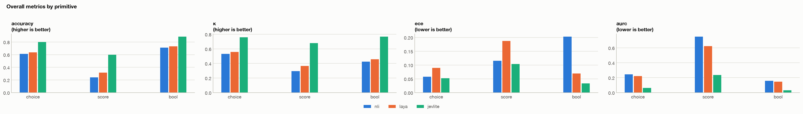
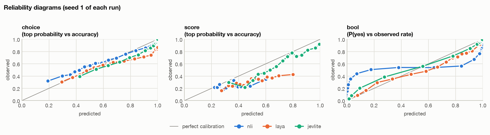
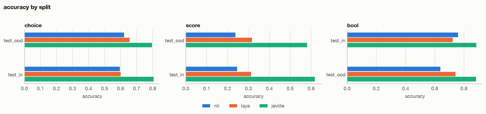
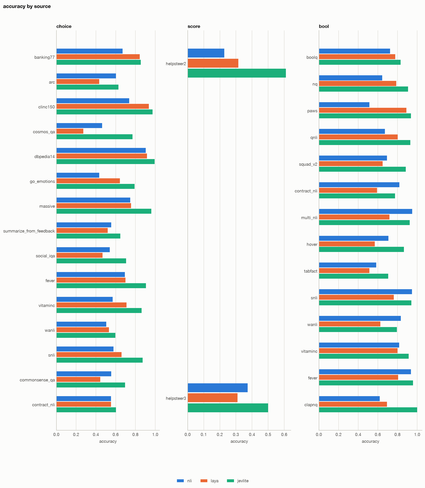
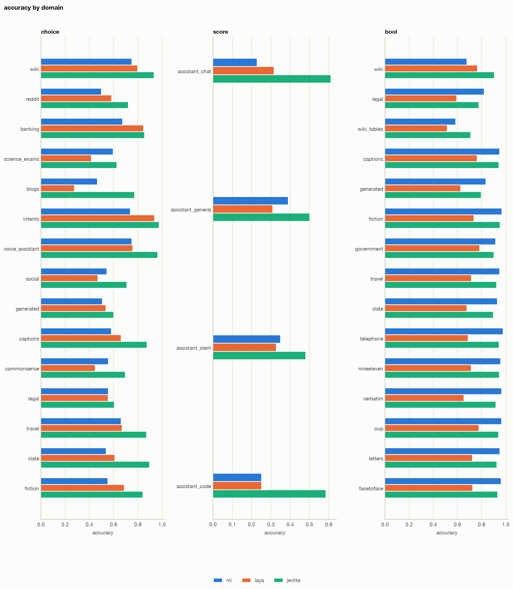
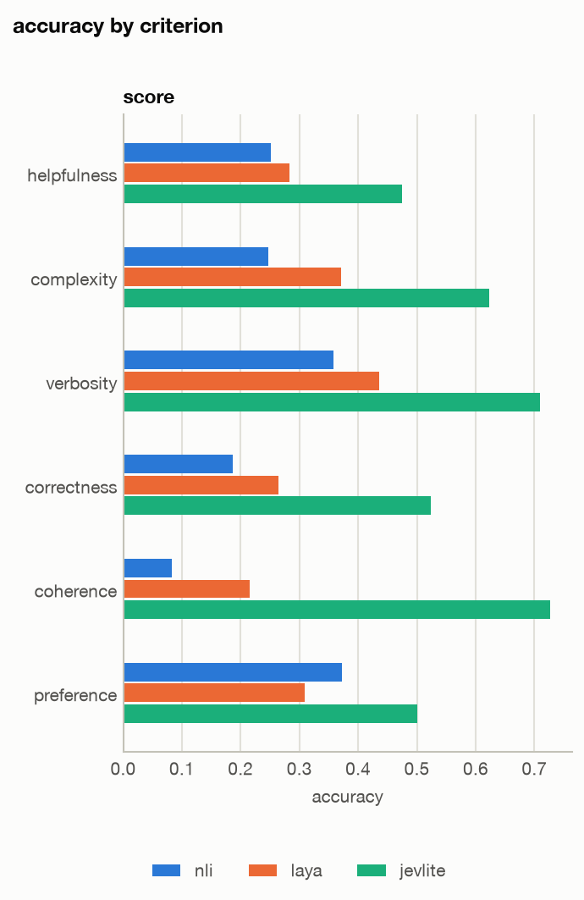
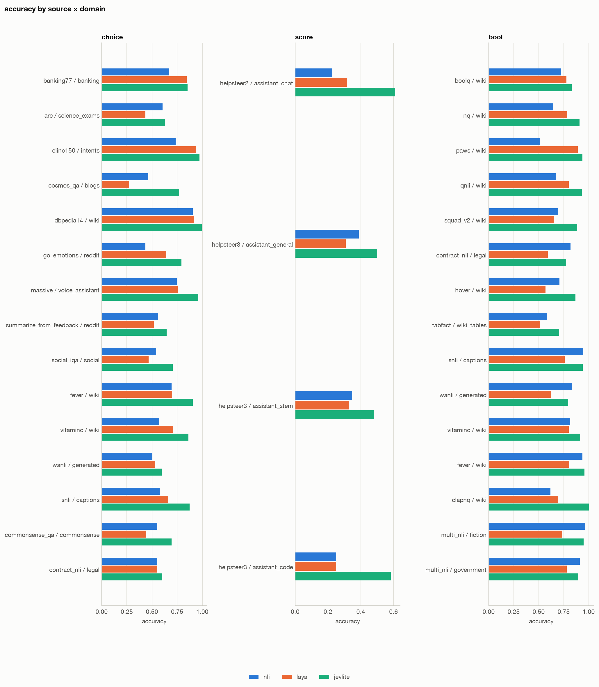

# Comparison report

Generated 2026-10-10 by `scripts/make_report.py compare`.

## Runs

| run | seeds | x | reports |
|---|---|---|---|
| nli | 1 |  | `data/baselines/reports/nli/report.json` |
| laya | 1 |  | `data/baselines/reports/laya/report.json` |
| jevlite | 1 |  | `data/runs/stage_a-full-s42/report/report.json` |

## Overall

[Interactive version](figures/overall.html)

### choice

| run | seeds | n | accuracy | κ | nll | brier | ece | aurc | sel.acc@80 |
|---|---|---|---|---|---|---|---|---|---|
| nli | 1 | 27979 | 0.611 | 0.531 | 1.053 | 0.526 | 0.057 | 0.244 | 0.658 |
| laya | 1 | 27979 | 0.635 | 0.558 | 1.525 | 0.514 | 0.089 | 0.222 | 0.687 |
| jevlite | 1 | 27979 | **0.800** | **0.758** | **0.542** | **0.285** | **0.052** | **0.063** | **0.869** |

### score

| run | seeds | n | accuracy | κ | spearman | mae | nll | ece | aurc |
|---|---|---|---|---|---|---|---|---|---|
| nli | 1 | 2220 | 0.241 | 0.294 | 0.005 | 1.205 | 1.558 | 0.115 | 0.749 |
| laya | 1 | 2220 | 0.314 | 0.366 | 0.222 | 1.027 | 1.542 | 0.187 | 0.624 |
| jevlite | 1 | 2220 | **0.599** | **0.678** | **0.666** | **0.591** | **1.029** | **0.104** | **0.236** |

### bool

| run | seeds | n | accuracy | κ | nll | brier | ece | ece (top) | aurc | sel.acc@80 |
|---|---|---|---|---|---|---|---|---|---|---|
| nli | 1 | 17358 | 0.712 | 0.425 | 0.907 | 0.231 | 0.202 | 0.202 | 0.158 | 0.763 |
| laya | 1 | 17358 | 0.730 | 0.456 | 0.549 | 0.182 | 0.070 | 0.067 | 0.147 | 0.780 |
| jevlite | 1 | 17358 | **0.883** | **0.766** | **0.285** | **0.086** | **0.033** | **0.034** | **0.030** | **0.945** |

### Δ vs reference

Δ = run − nli (mean over seeds). For ECE and AURC lower is better, so a negative Δ is an improvement.

| run | primitive | Δ accuracy | Δ κ | Δ ece | Δ aurc |
|---|---|---|---|---|---|
| laya | choice | +0.023 | +0.028 | +0.032 | -0.023 |
| laya | score | +0.073 | +0.072 | +0.072 | -0.125 |
| laya | bool | +0.018 | +0.032 | -0.133 | -0.011 |
| jevlite | choice | +0.188 | +0.228 | -0.005 | -0.181 |
| jevlite | score | +0.358 | +0.384 | -0.012 | -0.513 |
| jevlite | bool | +0.171 | +0.341 | -0.169 | -0.128 |

## Calibration

Points on the diagonal mean that stated probabilities match observed frequencies. Points below it: overconfident.

[Interactive version](figures/reliability.html)

## Selective prediction (cascade)

Read the curve at the coverage you are willing to answer locally: its height is the error rate there. The rest is escalated to the LLM judge.

[Interactive version](figures/risk_coverage.html)

| run | primitive | AURC | sel.acc@80 | sel.acc@90 |
|---|---|---|---|---|
| nli | choice | 0.244 | 0.658 | 0.634 |
| nli | score | 0.749 | 0.233 | 0.234 |
| nli | bool | 0.158 | 0.763 | 0.736 |
| laya | choice | 0.222 | 0.687 | 0.661 |
| laya | score | 0.624 | 0.336 | 0.322 |
| laya | bool | 0.147 | 0.780 | 0.754 |
| jevlite | choice | 0.063 | 0.869 | 0.832 |
| jevlite | score | 0.236 | 0.675 | 0.633 |
| jevlite | bool | 0.030 | 0.945 | 0.918 |

## Cost and latency

| run | latency p50, ms | latency p95, ms | cost per record, $ |
|---|---|---|---|
| nli | 28.1 | 573.0 | – |
| laya | 52.8 | 143.8 | – |

## Slices (accuracy)

[Interactive version](figures/slice_split.html)

**choice** — accuracy

| split | n | nli | laya | jevlite |
|---|---|---|---|---|
| test_ood | 17477 | 0.621 | 0.656 | 0.796 |
| test_in | 10502 | 0.595 | 0.600 | 0.805 |

**score** — accuracy

| split | n | nli | laya | jevlite |
|---|---|---|---|---|
| test_ood | 1111 | 0.238 | 0.317 | 0.581 |
| test_in | 1109 | 0.245 | 0.312 | 0.618 |

**bool** — accuracy

| split | n | nli | laya | jevlite |
|---|---|---|---|---|
| test_in | 10578 | 0.759 | 0.722 | 0.884 |
| test_ood | 6780 | 0.638 | 0.741 | 0.882 |

[Interactive version](figures/slice_source.html)

**choice** — accuracy

| source | n | nli | laya | jevlite |
|---|---|---|---|---|
| banking77 | 3000 | 0.670 | 0.843 | 0.853 |
| arc | 2000 | 0.604 | 0.433 | 0.627 |
| clinc150 | 2000 | 0.736 | 0.935 | 0.972 |
| cosmos_qa | 2000 | 0.463 | 0.273 | 0.769 |
| dbpedia14 | 2000 | 0.905 | 0.916 | 0.994 |
| go_emotions | 2000 | 0.433 | 0.643 | 0.792 |
| massive | 2000 | 0.747 | 0.755 | 0.961 |
| summarize_from_feedback | 2000 | 0.555 | 0.520 | 0.646 |
| social_iqa | 1949 | 0.541 | 0.467 | 0.705 |
| fever | 1344 | 0.693 | 0.699 | 0.906 |
| vitaminc | 1342 | 0.570 | 0.709 | 0.863 |
| wanli | 1337 | 0.505 | 0.533 | 0.596 |
| snli | 1326 | 0.578 | 0.660 | 0.873 |
| commonsense_qa | 1197 | 0.554 | 0.444 | 0.694 |
| contract_nli | 1037 | 0.554 | 0.553 | 0.603 |

**score** — accuracy

| source | n | nli | laya | jevlite |
|---|---|---|---|---|
| helpsteer2 | 2000 | 0.227 | 0.315 | 0.610 |
| helpsteer3 | 220 | 0.373 | 0.309 | 0.500 |

**bool** — accuracy

| source | n | nli | laya | jevlite |
|---|---|---|---|---|
| boolq | 2000 | 0.725 | 0.777 | 0.831 |
| nq | 2000 | 0.643 | 0.787 | 0.907 |
| paws | 2000 | 0.513 | 0.890 | 0.936 |
| qnli | 2000 | 0.672 | 0.801 | 0.930 |
| squad_v2 | 2000 | 0.693 | 0.649 | 0.883 |
| contract_nli | 1054 | 0.819 | 0.591 | 0.775 |
| multi_nli | 1053 | 0.950 | 0.718 | 0.925 |
| hover | 1000 | 0.707 | 0.568 | 0.866 |
| tabfact | 1000 | 0.583 | 0.513 | 0.706 |
| snli | 674 | 0.947 | 0.761 | 0.941 |
| wanli | 663 | 0.833 | 0.624 | 0.793 |
| vitaminc | 658 | 0.816 | 0.799 | 0.913 |
| fever | 656 | 0.936 | 0.806 | 0.959 |
| clapnq | 600 | 0.618 | 0.692 | 1.000 |

[Interactive version](figures/slice_domain.html)

**choice** — accuracy

| domain | n | nli | laya | jevlite |
|---|---|---|---|---|
| wiki | 4686 | 0.748 | 0.795 | 0.931 |
| reddit | 3959 | 0.495 | 0.581 | 0.719 |
| banking | 3000 | 0.670 | 0.843 | 0.853 |
| science_exams | 2500 | 0.592 | 0.414 | 0.623 |
| blogs | 2000 | 0.463 | 0.273 | 0.769 |
| intents | 2000 | 0.736 | 0.935 | 0.972 |
| voice_assistant | 2000 | 0.747 | 0.755 | 0.961 |
| social | 1949 | 0.541 | 0.467 | 0.705 |
| generated | 1337 | 0.505 | 0.533 | 0.596 |
| captions | 1326 | 0.578 | 0.660 | 0.873 |
| commonsense | 1197 | 0.554 | 0.444 | 0.694 |
| legal | 1037 | 0.554 | 0.553 | 0.603 |
| travel | 123 | 0.659 | 0.667 | 0.870 |
| slate | 112 | 0.536 | 0.607 | 0.893 |
| fiction | 111 | 0.550 | 0.685 | 0.838 |

**score** — accuracy

| domain | n | nli | laya | jevlite |
|---|---|---|---|---|
| assistant_chat | 2000 | 0.227 | 0.315 | 0.610 |
| assistant_general | 162 | 0.389 | 0.309 | 0.500 |
| assistant_stem | 46 | 0.348 | 0.326 | 0.478 |
| assistant_code | 12 | 0.250 | 0.250 | 0.583 |

**bool** — accuracy

| domain | n | nli | laya | jevlite |
|---|---|---|---|---|
| wiki | 12914 | 0.675 | 0.763 | 0.904 |
| legal | 1054 | 0.819 | 0.591 | 0.775 |
| wiki_tables | 1000 | 0.583 | 0.513 | 0.706 |
| captions | 674 | 0.947 | 0.761 | 0.941 |
| generated | 663 | 0.833 | 0.624 | 0.793 |
| fiction | 139 | 0.964 | 0.734 | 0.950 |
| government | 137 | 0.912 | 0.781 | 0.898 |
| travel | 129 | 0.946 | 0.713 | 0.922 |
| slate | 123 | 0.927 | 0.675 | 0.894 |
| telephone | 121 | 0.975 | 0.686 | 0.942 |
| nineeleven | 90 | 0.956 | 0.711 | 0.944 |
| verbatim | 83 | 0.964 | 0.651 | 0.916 |
| oup | 80 | 0.963 | 0.775 | 0.938 |
| letters | 79 | 0.949 | 0.722 | 0.924 |
| facetoface | 72 | 0.958 | 0.722 | 0.931 |

[Interactive version](figures/slice_criterion.html)

**score** — accuracy

| criterion | n | nli | laya | jevlite |
|---|---|---|---|---|
| helpfulness | 417 | 0.252 | 0.283 | 0.475 |
| complexity | 409 | 0.247 | 0.372 | 0.623 |
| verbosity | 399 | 0.358 | 0.436 | 0.709 |
| correctness | 390 | 0.187 | 0.264 | 0.523 |
| coherence | 385 | 0.083 | 0.216 | 0.727 |
| preference | 220 | 0.373 | 0.309 | 0.500 |

[Interactive version](figures/slice_source_x_domain.html)

**choice** — accuracy

| source × domain | n | nli | laya | jevlite |
|---|---|---|---|---|
| banking77 / banking | 3000 | 0.670 | 0.843 | 0.853 |
| arc / science_exams | 2000 | 0.604 | 0.433 | 0.627 |
| clinc150 / intents | 2000 | 0.736 | 0.935 | 0.972 |
| cosmos_qa / blogs | 2000 | 0.463 | 0.273 | 0.769 |
| dbpedia14 / wiki | 2000 | 0.905 | 0.916 | 0.994 |
| go_emotions / reddit | 2000 | 0.433 | 0.643 | 0.792 |
| massive / voice_assistant | 2000 | 0.747 | 0.755 | 0.961 |
| summarize_from_feedback / reddit | 1959 | 0.558 | 0.518 | 0.645 |
| social_iqa / social | 1949 | 0.541 | 0.467 | 0.705 |
| fever / wiki | 1344 | 0.693 | 0.699 | 0.906 |
| vitaminc / wiki | 1342 | 0.570 | 0.709 | 0.863 |
| wanli / generated | 1337 | 0.505 | 0.533 | 0.596 |
| snli / captions | 1326 | 0.578 | 0.660 | 0.873 |
| commonsense_qa / commonsense | 1197 | 0.554 | 0.444 | 0.694 |
| contract_nli / legal | 1037 | 0.554 | 0.553 | 0.603 |

**score** — accuracy

| source × domain | n | nli | laya | jevlite |
|---|---|---|---|---|
| helpsteer2 / assistant_chat | 2000 | 0.227 | 0.315 | 0.610 |
| helpsteer3 / assistant_general | 162 | 0.389 | 0.309 | 0.500 |
| helpsteer3 / assistant_stem | 46 | 0.348 | 0.326 | 0.478 |
| helpsteer3 / assistant_code | 12 | 0.250 | 0.250 | 0.583 |

**bool** — accuracy

| source × domain | n | nli | laya | jevlite |
|---|---|---|---|---|
| boolq / wiki | 2000 | 0.725 | 0.777 | 0.831 |
| nq / wiki | 2000 | 0.643 | 0.787 | 0.907 |
| paws / wiki | 2000 | 0.513 | 0.890 | 0.936 |
| qnli / wiki | 2000 | 0.672 | 0.801 | 0.930 |
| squad_v2 / wiki | 2000 | 0.693 | 0.649 | 0.883 |
| contract_nli / legal | 1054 | 0.819 | 0.591 | 0.775 |
| hover / wiki | 1000 | 0.707 | 0.568 | 0.866 |
| tabfact / wiki_tables | 1000 | 0.583 | 0.513 | 0.706 |
| snli / captions | 674 | 0.947 | 0.761 | 0.941 |
| wanli / generated | 663 | 0.833 | 0.624 | 0.793 |
| vitaminc / wiki | 658 | 0.816 | 0.799 | 0.913 |
| fever / wiki | 656 | 0.936 | 0.806 | 0.959 |
| clapnq / wiki | 600 | 0.618 | 0.692 | 1.000 |
| multi_nli / fiction | 139 | 0.964 | 0.734 | 0.950 |
| multi_nli / government | 137 | 0.912 | 0.781 | 0.898 |

## How to read the metrics

- **accuracy** — share of correct answers (for soft targets: the target mass on the predicted answer).
- **κ** — Cohen's kappa: agreement with the labels beyond chance; 0 = chance, 1 = perfect. Quadratic-weighted for Score.
- **NLL**, **Brier** — proper scores of the whole probability distribution; lower is better.
- **ECE** — expected calibration error: the average gap between stated confidence and observed accuracy (equal-mass bins); 0 = perfectly calibrated. For Bool it is measured on P(yes); `ece (top)` on max(p, 1 − p).
- **AURC**, **sel.acc@80** — selective prediction: answer the most confident examples first. AURC is the area under the risk–coverage curve (lower is better); sel.acc@80 is the accuracy on the 80% most confident examples. This is the cascade trade-off: coverage = share answered locally, the rest escalates.
- Seeds: values are means over seeds, with the min–max range in brackets and as error bars.
