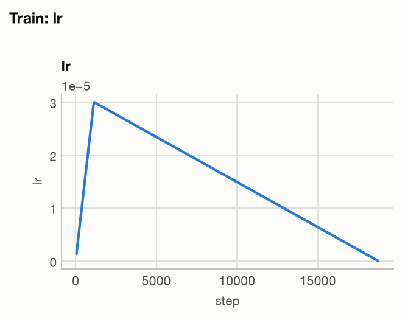
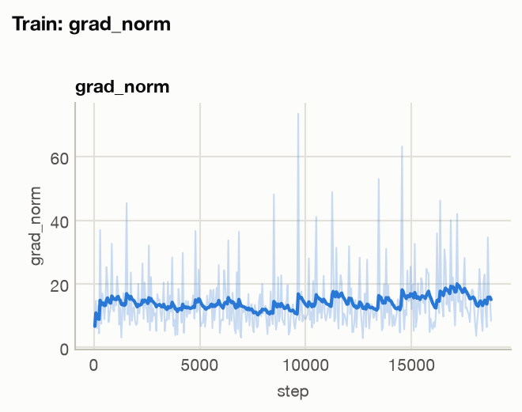
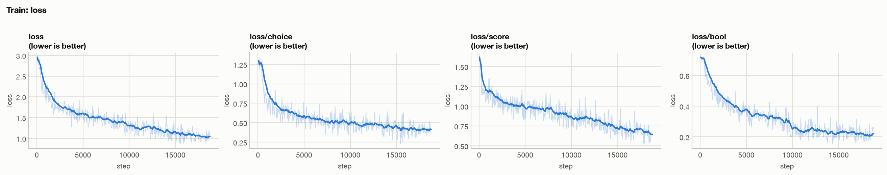
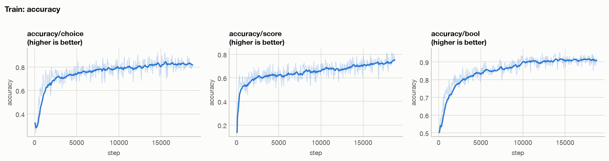
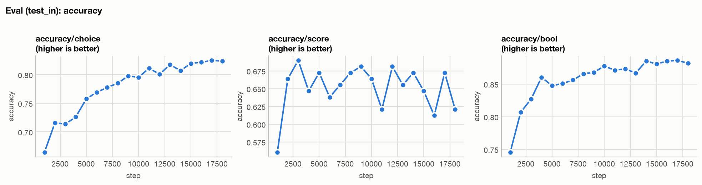
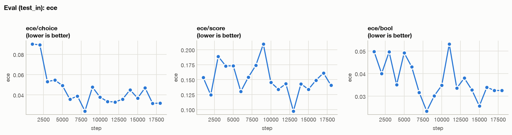
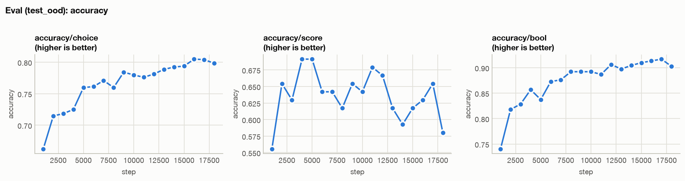
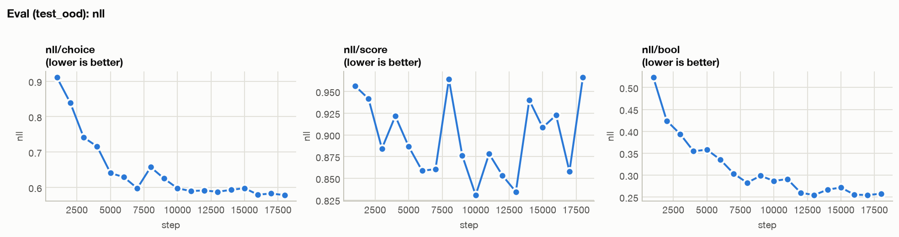
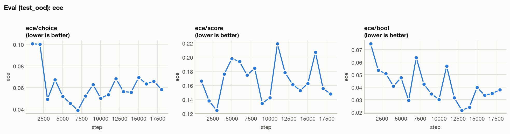

# Training report

Generated 2026-10-10 by `scripts/make_report.py training`.

## Runs

| run | train steps | last step | eval points | stack | log |
|---|---|---|---|---|---|
| stage_a-full-s42 | 375 | 18750 | 36 | cuda | `data/runs/stage_a-full-s42` |

## Training curves

Lines are smoothed with an EMA (α = 0.9); the faint line is the raw value.

[Interactive version](figures/train_lr.html)

[Interactive version](figures/train_grad_norm.html)

[Interactive version](figures/train_loss.html)

[Interactive version](figures/train_accuracy.html)

## Evaluation — test_in

[Interactive version](figures/eval_test_in_accuracy.html)

[Interactive version](figures/eval_test_in_nll.html)

[Interactive version](figures/eval_test_in_ece.html)

Last evaluation, with the best value and its step when it is not the last:

| key | stage_a-full-s42 |
|---|---|
| accuracy/choice | 0.8237 (best 0.8248 @ 17000) |
| accuracy/score | 0.6207 (best 0.6897 @ 3000) |
| accuracy/bool | 0.8818 (best 0.8861 @ 17000) |
| nll/choice | 0.4826 |
| nll/score | 1.0283 (best 0.8646 @ 12000) |
| nll/bool | 0.2925 (best 0.2843 @ 16000) |
| ece/choice | 0.0318 (best 0.0240 @ 8000) |
| ece/score | 0.1404 (best 0.0974 @ 13000) |
| ece/bool | 0.0325 (best 0.0234 @ 8000) |

## Evaluation — test_ood

[Interactive version](figures/eval_test_ood_accuracy.html)

[Interactive version](figures/eval_test_ood_nll.html)

[Interactive version](figures/eval_test_ood_ece.html)

Last evaluation, with the best value and its step when it is not the last:

| key | stage_a-full-s42 |
|---|---|
| accuracy/choice | 0.7982 (best 0.8049 @ 16000) |
| accuracy/score | 0.5802 (best 0.6914 @ 4000) |
| accuracy/bool | 0.9028 (best 0.9170 @ 17000) |
| nll/choice | 0.5784 |
| nll/score | 0.9662 (best 0.8306 @ 10000) |
| nll/bool | 0.2577 (best 0.2544 @ 13000) |
| ece/choice | 0.0581 (best 0.0388 @ 7000) |
| ece/score | 0.1477 (best 0.1245 @ 3000) |
| ece/bool | 0.0378 (best 0.0215 @ 13000) |
